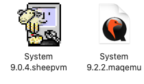

# Maqemu

An application for configuring and running MacOS virtual machines, using the QEMU emulator.

## Bundling Virtual Machines

The basic motiviation for this app was to facilitate bundling a virtual machine up as a single document, which contains both the drive files and the configuration information.

This is similar to the way SheepShaver allows you to make a sheepvm bundle:

   


Although the Finder treats this document as a single file, it's actually a folder with the `.maqemu` file extension.

The eventual plan is that you will be able to create and edit `.maqemu` files completely from within the application itself, so you will never need to look inside one.

For now though, you have to make them manually, so it's worth talking a bit about their structure and the format of the settings file they contain.

### Structure 

You can reveal the contents of a `.maqemu` bundle by right-clicking on it and choosing `Show Package Contents`.

Inside it, you can expect to see one or more drive files, and a `settings.json` file containing configuration information:

```
System 9.2.2.maqemu/
    922.qcow2
    shared.qcow2
    settings.json
```

If you are creating a bundle yourself, you need to move your drive files into it. You can create symbolic links to drive files that are located elsewhere, but then the qemu bundle will not be standalone, which slightly defeats the object of the exercise.

### Settings

When you double-click on a `.mqemu` bundle, it opens up as a window in Maqemu. Eventually this window will allow you to edit the settings; currently it just displays them. 

When you click the `Run` button, Maqemu reads the  `settings.json` file in the bundle work out what settings to launch QEMU with.

This JSON file contains enough information to build up all the command line options that you'd have to supply if you were launching `qemu-system-ppc` yourself.

Currently the file looks something like this:

```json
{
    "disks": [
        "922.qcow2",
        "large.qcow2"
    ],

    "devices" : [
      "usb-mouse",
      "usb-kbd",
      "sungem,netdev=mynet0"
    ],

    "options" : {
      "boot order": "cd",
      "machine": "mac99,via=pmu",
      "memory": "512",
      "language": "en-us"
    },

    "extras": [
        "-prom-env", "'auto-boot?=true'",
        "-prom-env", "'vga-ndrv?=true'",
        "-netdev", "user,id=mynet0",
        "-g", "1024x768x32",
        "-no-reboot"
    ]
}
```

This generates a command line like this:

```
> qemu.system.ppc -L pc-bios -name System 9.2.2.maqemu -m 512 -boot cd -M mac99,via=pmu -k en-us -device usb-mouse -device usb-kbd -device sungem,netdev=mynet0 -prom-env 'auto-boot?=true' -prom-env 'vga-ndrv?=true' -netdev user,id=mynet0 -g 1024x768x32 -no-reboot -hda /Volumes/caconym/Users/sam/Dropbox/Emulators/MacOS/System 9.2.2.maqemu/922.qcow2 -hdb /Volumes/caconym/Users/sam/Dropbox/Emulators/MacOS/System 9.2.2.maqemu/large.qcow2
```

This format is very much under development, and almost bound to change.

Right now, it works like this:

- items in `disks` generate an `-hda`, `-hdb` etc argument (with the letter increasing each time)
- items in `devices` generate a `-device` a device argument
- items in `options` generate a pair of arguments each; the first is a switch (see below for the mapping of names to switch), the second is the option value, unaltered
- items in `extras` are appended to the command line unaltered

The mappings for the options are as follows:

- "machine": "-M"
- "memory": "-m"
- "language": "-k"
- "boot order": "-boot"


## Plans

This is an early release, built for myself primarily.

Some things I'm considering supporting:

- menu commands to download / build QEMU (if bundling it with the app proves not to be feasible, or maybe anyway)
- support for creating new drives and adding them to a bundled vm
- support for importing existing drives into a bundled vm (either copying/moving them into the bundle, or linking to them)
- nicer support for configuring various options
- support for installing fresh systems (clearly this has to be done legally; I will not host images, but if there is a legal way to make it easier to create a new VM and install a system onto it - perhaps by downloading an .iso from a known location - I'd like to do it)  
